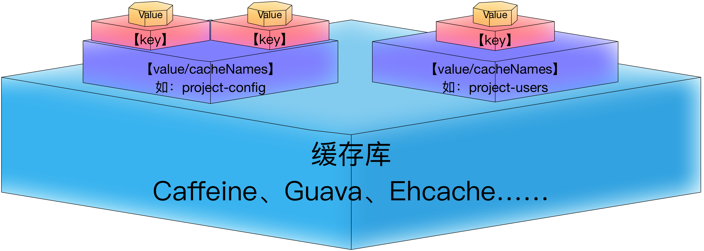
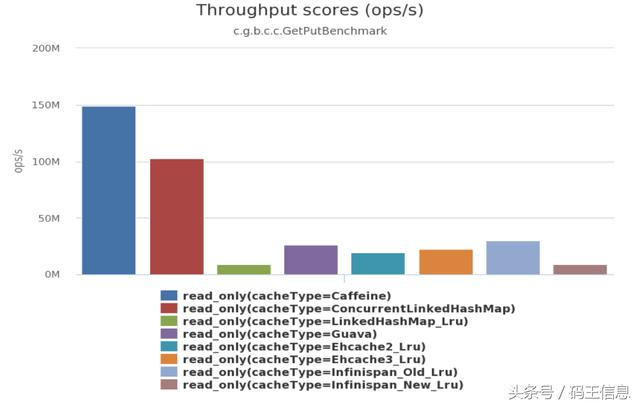
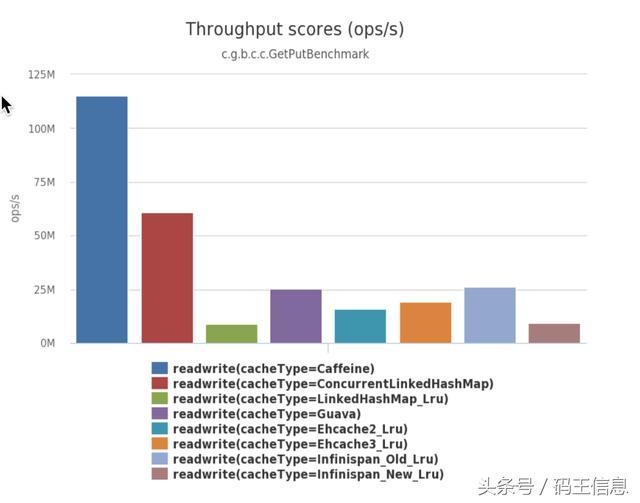
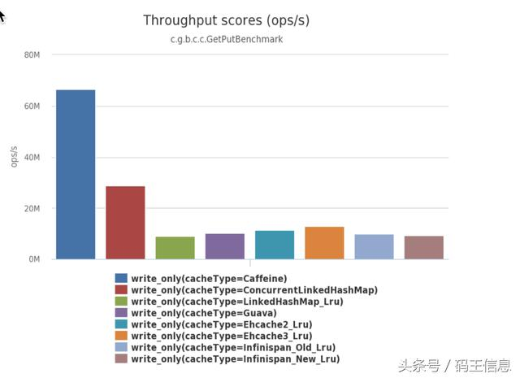

## 目录

[TOC]

## Kitchen网关中接口的缓存


### 用途

- 作用范围：查询类的业务处理
- 应用于幂等性的方法，即同样的输入，返回同样的数据（在数据没有变更时）
- 减轻后端业务处理的压力
- 增强网关的并发能力
- 缓存需要从远程或中心读取的，非频繁刷新的配置类信息
- 缓存更新频率较低，但调用量较大的业务信息

`注意根据业务需求，衡量业务查询数据的有效周期，设置缓存的失效时间。太长不利于数据的新鲜度，太短则不利于缓存的命中率。`

### 缓存的结构




紫色中，通过注解的value或cacheNames属性指定的值，相当于**缓存索引的前缀**（指定到唯一的Map对象）；

红色中，通过注解的key属性指定的值，相当于**缓存索引的后缀**（Map对象中的键值对）；

通过索引前缀+后缀，才能唯一确认一个缓存值。


### 缓存注解

介绍了Spring中各个缓存注解的使用和意义。

> 注意
>
> - 若没有指定key，则springboot则使用全部的方法参数计算一个key值，作为保存到缓存中的key。
> - 当一个支持缓存的方法在对象内部被调用时是不会触发缓存功能的。
> - 只能缓存实现了java.io.Serializable接口的，可序列化的实体。

#### @CacheConfig

- 作用域：Class

- 说明：主要用于配置该类中会用到的一些共用的缓存配置。

- 示例：

  ```java
  @Component
  @CacheConfig(cacheNames = "users")
  public class xxxService {}
  或
  @Component
  @CacheConfig(cacheNames = "users")
  public interface xxxService {}
  ```

  @CacheConfig配置了该类中，所有的公共方法的返回结果，将存储于名为users的缓存对象中（具体存储的键需从方法级缓存注解中定义，即key属性，若没有指定key，则springboot会将方法参数组合后作为key）。也可以不使用该注解，直接通过@Cacheable自己配置缓存集的名字来定义。cacheNames属性等同于方法级注解（@Cacheable、@CachePut、@CacheEvict）中的value属性。

  ​

#### @Cacheable

- 作用域：Function

- 说明：

  标注某个方法（必须是public方法）的返回值，将被加入缓存。下次再执行此方法时，将会先从缓存中进行查询。

  `若多个线程发起相同参数值的请求，同时访问标注了缓存注解的同一个方法，且该方法的返回结果未在缓存中找到时，缓存库的默认处理策略是只放出一个线程去做业务处理，其它线程等待，处理完成且结果缓存后，通知其它线程从缓存中拿结果。`

- 参数说明：

  - **value、cacheNames**：缓存key的前缀。两个等同的参数（cacheNames为Spring 4新增，作为value的别名），用于指定缓存存储的集合名。由于Spring 4中新增了@CacheConfig，因此在Spring 3中原本必须有的value属性，也成为非必需项了。

  - **key**：缓存key的后缀。缓存对象存储在Map集合中的key值，非必需，缺省按照函数的所有参数组合作为key值。支持spring El表达式（SpEL），更多关于SpEL表达式的详细内容可参考官方文档。

    常用El表达式：

    ```java
    // 使用函数第一个参数作为缓存的key值
    @Cacheable(key = "#p0")

    // 使用函数中某个对象参数中的某个属性作为缓存的key值
    @Cacheable(key = "#userInfo.userId")
    public DemoCacheUserInfo addUser(DemoCacheUserInfo userInfo) {}

    // 使用函数中某个对象参数的多个属性，连接起来共同作为缓存的key值
    @Cacheable(key = "#userInfo.userId+#userInfo.userName")
    public DemoCacheUserInfo addUser(DemoCacheUserInfo userInfo) {}
    ```

  - **sync**：设置如果缓存过期是不是只放一个线程去进行业务处理，其他请求阻塞，默认是false。

  - **condition**：缓存对象的条件，非必需，也需使用SpEL表达式，只有满足表达式条件的内容才会被缓存，比如：@Cacheable(key = "#p0", condition = "#p0.length() < 3")，表示只有当第一个参数的长度小于3的时候才会被缓存。

  - **unless**：另外一个缓存条件参数，非必需，需使用SpEL表达式。它不同于condition参数的地方在于它的判断时机，该条件是在函数被调用之后才做判断的，所以它可以通过对result进行判断。如：`@Cacheable(value = "user-info", key = "#userInfo.userId", unless = "#result == null")`，表示返回参数不为null时才缓存。

  - keyGenerator：用于指定key生成器，非必需。若需要指定一个自定义的key生成器，我们需要去实现org.springframework.cache.interceptor.KeyGenerator接口，并使用该参数来指定。`需要注意的是：该参数与key是互斥的`

  - cacheManager：用于指定使用哪个缓存管理器，非必需。只有当有多个缓存管理器时才需要使用。

  - cacheResolver：用于指定使用那个缓存解析器，非必需。需通过org.springframework.cache.interceptor.CacheResolver接口来实现自己的缓存解析器，并用该参数指定。

#### @CachePut

- 作用域：Function
- 说明：能够根据参数定义条件来进行缓存，它与@Cacheable不同的是，它每次都会真是调用函数，所以主要用于数据新增和修改操作上。它的参数与@Cacheable类似，具体功能可参考上面对@Cacheable参数的解析。

#### @CacheEvict

- 作用域：Function

- 说明：通常用在删除方法上，用来从缓存中移除相应数据。

- 参数说明：除了同@Cacheable一样的参数之外，它还有其它参数。

  - **allEntries**：非必需，默认为false。当为true时，会移除所有数据。
  - **beforeInvocation**：非必需，默认为false，会在调用方法之后移除数据。当为true时，会在调用方法之前移除数据。

  ​


### 前置依赖

- 引入springboot的缓存依赖（Maven）

  ```xml
  <dependency>
  	<groupId>org.springframework.boot</groupId>
  	<artifactId>spring-boot-starter-cache</artifactId>
  </dependency>
  ```

- 在springboot启动类，使用注解（@EnableCaching）开启缓存

  ```java
  @SpringBootApplication
  @EnableCaching
  public class ApplicationBootstrap {
    ……
  }
  ```


### 本地缓存库

#### Caffeine（默认/首选）

Kitchen开发框架的网关中，即api-portal中，首选Caffeine作为api-portal的本地缓存（Spring5将放弃Guava，使用Caffeine作为Spring的缓存机制供应商，从目前的——2018年初——测试成绩来看，Caffeine的缓存性能远高于其它缓存库），若因业务需求，需要使用其他缓存库，则需要关闭此缓存的相关配置后，按照所需缓存库的开启步骤进行开启。

##### 如何开启

- 依赖库引入（Maven）

  ```xml
  <!--缓存框架Caffeine-->
  <dependency>
  	<groupId>com.github.ben-manes.caffeine</groupId>
  	<artifactId>caffeine</artifactId>
  	<version>2.6.1</version>
  </dependency>
  ```

- 配置缓存

  方式一**（Kitchen默认方式）**：在配置类中配置

  ​	优点：可以针对每个cache配置不同的参数，比如过期时长、最大容量

  ​	缺点：要写一点代码；对缓存配置做调整时，若未做额外处理，则需要编译后生效

  - CacheNames

  ```java
  package com.restaurant.dinner.portal.extension.cache;

  enum CacheNames {

      //TODO 示例
      //枚举名称对应注解的value或cacheNames属性值
      DEMO_CACHE_USER_INFO(10L, 10L),
      DEMO_CACHE_PROJECT_CONFIG
      ;

      /**
       * 默认配置，可根据业务需要调整
       */
      //初始的缓存条数，默认不填写此配置
      private Integer initialCapacity = null;
      //缓存的最大条数，默认最大1000条
      private Long maximumSize = 1000L;
      //最后一次写入或访问后经过固定时间过期[单位：秒]，默认5分钟后过期
      private Long expireAfterAccess = 300L;
      //最后一次写入后经过固定时间过期[单位：秒]，默认不填写此配置
      private Long expireAfterWrite = null;


      CacheNames() {
      }

      CacheNames(Long expireAfterAccess) {
          this.expireAfterAccess = expireAfterAccess;
      }

      CacheNames(Long expireAfterAccess, Long maximumSize) {
          this.expireAfterAccess = expireAfterAccess;
          this.maximumSize = maximumSize;
      }

      CacheNames(Long expireAfterAccess, Long maximumSize, Integer initialCapacity, Long expireAfterWrite) {
          this.expireAfterAccess = expireAfterAccess;
          this.maximumSize = maximumSize;
          this.initialCapacity = initialCapacity;
          this.expireAfterWrite = expireAfterWrite;
      }

      public Integer getInitialCapacity() {
          return initialCapacity;
      }

      public Long getMaximumSize() {
          return maximumSize;
      }

      public Long getExpireAfterAccess() {
          return expireAfterAccess;
      }

      public Long getExpireAfterWrite() {
          return expireAfterWrite;
      }
  }

  ```

  - CaffeineCacheConfig

  ```java
  package com.restaurant.dinner.portal.extension.cache;

  import com.github.benmanes.caffeine.cache.Caffeine;
  import org.springframework.cache.CacheManager;
  import org.springframework.cache.caffeine.CaffeineCache;
  import org.springframework.cache.support.SimpleCacheManager;
  import org.springframework.context.annotation.Bean;
  import org.springframework.context.annotation.Configuration;
  import org.springframework.context.annotation.Primary;

  import java.util.ArrayList;
  import java.util.concurrent.TimeUnit;

  @Configuration
  public class CaffeineCacheConfig {

      @Bean
      @Primary
      public CacheManager caffeineCacheManager() {
          SimpleCacheManager cacheManager = new SimpleCacheManager();

          ArrayList<CaffeineCache> caffeineCaches = new ArrayList<>();

          for(CacheNames caches : CacheNames.values()) {

              Caffeine<Object, Object> caffeine = Caffeine.newBuilder();
              caffeine.maximumSize(caches.getMaximumSize());
              if (caches.getInitialCapacity() != null) {
                  caffeine.initialCapacity(caches.getInitialCapacity());
              }
              if (caches.getExpireAfterWrite() != null) {
                  caffeine.expireAfterWrite(caches.getExpireAfterWrite(), TimeUnit.SECONDS);
              } else {
                  caffeine.expireAfterAccess(caches.getExpireAfterAccess(), TimeUnit.SECONDS);
              }

              CaffeineCache caffeineCache = new CaffeineCache(
                      caches.name(),
                      caffeine.build()
              );
              caffeineCaches.add(caffeineCache);
          }

          cacheManager.setCaches(caffeineCaches);

          return cacheManager;
      }
  }

  ```

  ​

  方式二：设置配置文件（application.yml）

  ​	优点：简单

  ​	缺点：无法针对每个cache配置不同的参数，比如过期时长、最大容量

  ```yaml
  spring:
    cache:
    	# 指定spring使用的缓存类型为caffeine
      type: caffeine
      # 预设需要缓存的key前缀
      cache-names:
        - user-info
        - config
      caffeine:
        # 设置caffeine的属性
        spec: maximumSize=500,expireAfterWrite=5s
  ```

  **注意：**若不预设cache-names，则缓存库会根据注解中的value或cacheNames指定的值，自动创建响应的缓存对象。若预设了cache-names，则自动创建机制失效，所有缓存注解中的value或cacheNames值必须存在于预设的cache-names中，否则会抛出异常：

  ```
  java.lang.IllegalArgumentException: Cannot find cache named '***' for Builder[***] caches=[***] | key='#userInfo.userId' | keyGenerator='' | cacheManager='' | cacheResolver='' | condition='' | unless='#result == null' | sync='false'
  ```

##### 配置说明

> 若业务需求需要对每个缓存的属性分别进行控制，则使用上文中的方式一进行缓存配置，需确保所有缓存注解中的value或cacheNames值必须存在于预设的cache-names中。
>
> 若业务需求对所有缓存都执行相同的配置，则可以使用上文中的方式二进行缓存配置，且无需设置cache-names。

Caffeine的配置属性说明：

- initialCapacity=[integer]: 初始的缓存条数
- maximumSize=[long]: 缓存的最大条数
- maximumWeight=[long]: 缓存的最大权重
- expireAfterAccess=[duration]: 最后一次写入或访问后经过固定时间过期
- expireAfterWrite=[duration]: 最后一次写入后经过固定时间过期
- refreshAfterWrite=[duration]: 创建缓存或者最近一次更新缓存后经过固定的时间间隔，刷新缓存
- weakKeys: 打开key的弱引用
- weakValues：打开value的弱引用
- softValues：打开value的软引用
- recordStats：开发统计功能

注意

- expireAfterWrite和expireAfterAccess同事存在时，以expireAfterWrite为准。

- maximumSize和maximumWeight不可以同时使用

- weakValues和softValues不可以同时使用

- refreshAfterWrite属性必须要指定CacheLoader类才可生效

  ```java
  /**
   * 必须要指定这个Bean，refreshAfterWrite=5s这个配置属性才生效
   */
  @Bean
  public CacheLoader<Object, Object> cacheLoader() {
      CacheLoader<Object, Object> cacheLoader = new CacheLoader<Object, Object>() {
          @Override
          public Object load(Object key) throws Exception {
              return null;
          }
          // 重写这个方法将oldValue值返回回去，进而刷新缓存
          @Override
          public Object reload(Object key, Object oldValue) throws Exception {
              return oldValue;
          }
      };
      return cacheLoader;
  }
  ```

  ​

  ​

#### Guava缓存

##### 如何开启

- 依赖库引入（Maven）
- ​

##### 配置说明


#### SpringBoot1.5.x 默认缓存

Spring boot默认使用的是SimpleCacheConfiguration，即使用ConcurrentMapCacheManager来实现缓存。

##### 如何开启

- 依赖库引入（Maven）
- ​

##### 配置说明


### 远程缓存库

#### Redis（默认/首选）

##### 如何开启

- 依赖库引入（Maven）
- ​

##### 配置说明


#### Ehcache3

Ehcache即支持本地缓存，也支持分布式缓存，与Redis不同，Ehcache无需部署独立组件，以java库的形式存在，寄生于项目中。

##### 如何开启

- 依赖库引入（Maven）
- ​

##### 配置说明


## 测试用例说明


## 附录

### 缓存库性能对比

参考资料：http://www.genshuixue.com/i-cxy/p/15629405

场景一：8个线程读，100%的读操作



场景二：6个线程读，2个线程写，也就是75%的读操作，25%的写操作



场景三：8个线程写，100%的写操作



### 遗留问题

- 如何在控制层（Controller）增加缓存，缓存整个接口的请求